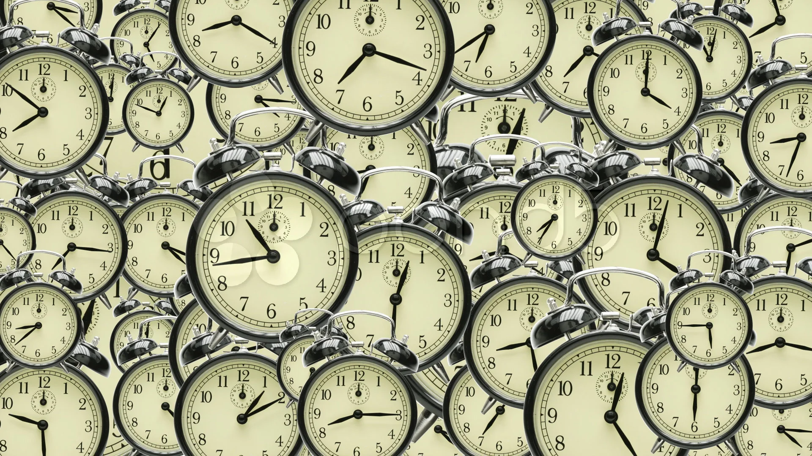
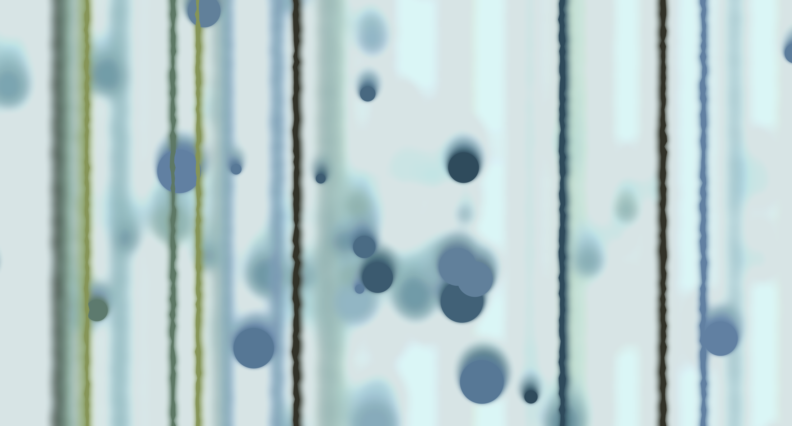

# ypan0516_9103_Major-Project
Creative coding major project_Functioning prototype

## Choose to use the level or frequency content of an audio track to animate the work
Firstly, I reconstructed the conceptual framework of this image design by changing and adding new elements to the group's code images, adding more possibilities and design concepts to the original design concept of "Wheels of Fortune". For example, constantly rotating and moving circles will always converge into another circular image at a certain moment, just like the "cycle" in the original concept, where each cycle will continue to change, but eventually it will still move towards a normal track. The images below are raw images of the team's work.

In terms of selecting sound clips, I chose the "Fate Symphony" arranged by Beethoven, which is consistent with the image style and design concept of this project. The rhythm and sound curve of this piece have the characteristic of ups and downs, which can create more visual changes.

## Change the original group task image
In this section, I mainly made some changes to the original colors in the group code, such as adjusting the background color to a random Moranti color scheme, to create a higher sense of motion for the new image. In terms of functional setting changes, the main focus is to change the original dot background to a fan-shaped shape, and to change the ellipses (x, y) of those large circles to ellipses (0,0), and then use translate to control their positions. As shown in the image below, the fan-shaped shape changes with the frequency of the sound.

## Instructions on how to interact with works
By clicking any keyboard button, the playback function can be triggered and waiting for the music to start. The circular pattern of internal rotation will shift and rotate to varying degrees with the frequency of the music, and the background color will also change through the playback of the music. The range of changes is within the range that matches other colors. Different fan-shaped elements will appear above the dots in the background, and as the sound increases, the angle of fan-shaped opening will also increase, similar to the volume display of a music player. 
User can also pause music by clicking any keyboard button, at which point the circular shape and background color will stop changing, and the fan-shaped shape in the background will disappear, symbolizing the disappearance of volume. This is also consistent with the design of the "cycle" in the concept, which indicates the end of turbulence and a return to the right track.

## Detailed information on animating group code
This code creates an animation effect through audio analysis and interaction, mainly using the p5.js library to create a multi-layer, rotating, multi-color dot animation, and changes it according to the volume, frequency, and user interaction of the music. 

**Animated attributes and their variations:**
- Rotation angle and speed: Depending on the volume level, the rotation angle and speed will change. The higher the volume, the faster the rotation speed, and the more significant the angle change.
- Image scaling: As the volume increases, the image becomes larger, and vice versa. This effect is achieved through the 'scale' function.
- Color switching: When the volume reaches a certain threshold, the background color will change. By increasing and decreasing the 'backgroundColorIndex'.
- Motion speed: The volume level affects the speed value. When the volume is low, the image will randomly shake, and when the volume is high, the image will move smoothly according to the speed value.

**Differences from other group members:**
- Color switching: This code will switch the background color when the volume exceeds the threshold, and other group members may choose other triggering conditions or not switch the background color.
- Interactive control method: By using buttons to control the playback and pause of music, it adds elements of user interaction.

**Main Code Description**
- Variable declaration and initialization:
  - MultiCircles: Stores multiple MultiCircle objects. (*The relevant content comes from the stackhoverflow website*)
  - MultiCircleNum, innerMultiCircleNum, layerNum: represent the number of multiple circles, the number of inner concentric circles, and the number of outer layers, respectively.
  - DotSize, dotDensity: Indicates the size and density of points.
  - Music, analyzer, and level: used to store audio, volume analyzer, and current volume, respectively.
  - BackgroundColors, BackgroundColorIndex, BackgroundChangeCD: Used to store and switch background colors.
  - Move: Update the position of multiple circles based on volume and speed values to achieve motion effects.
  - velocity: The subset of the move instruction forms a speed threshold and jitter effect, and the speed and position jitter are specified by the size of the sound value. (*Specific learning comes from TikTok's programming teaching*)
  - generateRandomColors: Generate a random color array from allowed colors to generate various different colors in the RGB spectrum. (*The relevant content comes from the stackhoverflow website*)
  

- P5.js function:
  - Preload: Load audio files.
  - Setup: Initialize the canvas, volume analyzer, and multi circle objects.
  - Draw: Draw function used to draw background color, Polka dot background, obtain volume, switch background color, and so on
  - DrawPolkaDotBackground: Draw a dot background.
  - KeyPressed: controls the playback and pause of audio.
  - WindowResized: Resize the canvas to accommodate changes in the window.

## Animation inspiration for personal code
The real link to this image is a video of a continuously rotating clock, which inspired my idea to rotate the dots in the originally stationary circle at a uniform speed.
image 1: 
*image reference link: https://stock.adobe.com/au/images/many-clocks-on-wall/71253928*

The operation mode of this image is completely different from my code work, but what inspired me is that it can better fit my design theme by moving the position and angle of the large circular combination, and can also make the image more dynamic with the help of audio by changing the color and flashing mode. 
image 2: 
*image reference link: https://openprocessing.org/sketch/2241439*

